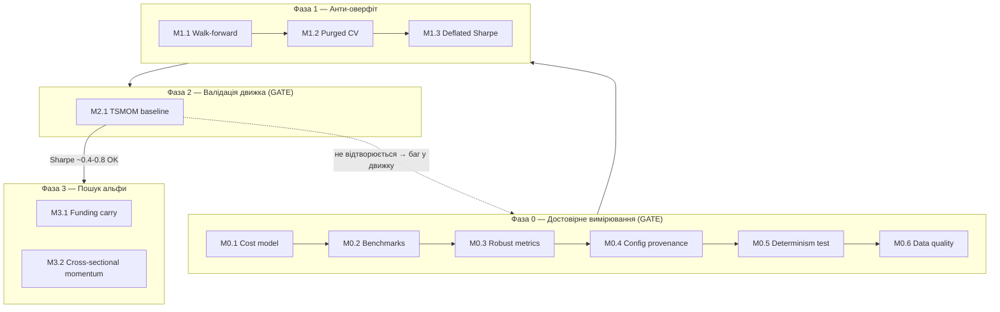

# Роадмап розвитку квант-системи

Технічний спек покращень системи. Кожен мілстоун — самодостатній таск із метою, прив'язкою до гексагональної архітектури та критеріями приймання.

**Стек:** Rust/Tokio · Kafka · ScyllaDB · PostgreSQL · React · ensemble ML · hexagonal architecture · Kafka-replay (єдиний пайплайн бектест + live).

**Головний принцип послідовності:** спершу лагодимо вимірювання (Фаза 0–1), і лише потім полюємо на альфу (Фаза 2–3). Поки бенчмарк, модель витрат і захист від оверфіту не залізні — будь-який «прибутковий» результат обманює.

---

## Інваріанти (не порушувати ніколи)

Залізні правила системи. Прямо лікують болячки, що спливли на захисті (розбіжність параметрів, PnL без бенчмарка).

1. **Єдиний шлях коду.** Бектест і live використовують ту саму логіку сигналів/виконання. Форк логіки під бектест заборонено — тільки різні adapter'и на портах. Це головна перевага системи, вона гарантується тестом (M0.5), а не обіцянкою.
2. **Витрати завжди увімкнені.** Жоден прогін не рахує PnL без транзакційних витрат. «Gross PnL» дозволений лише як окрема діагностична метрика поряд із net, ніколи замість.
3. **Нема look-ahead.** Фіча/сигнал у момент `t` використовує тільки дані з часом `≤ t`. Має бути неможливо порушити на рівні типів/API, а не за домовленістю.
4. **Детермінізм.** Той самий вхід + той самий config hash → побайтово той самий результат. Стосується і ML-ансамблю (фіксовані сіди).
5. **Provenance.** Кожен прогін логується з хешем повного конфіга. Немає «магічних» параметрів у коді — усе з конфіга.
6. **Decimal для грошей.** PnL, ціни, розміри позицій — `Decimal`, ніколи `f64`.

---

## Фаза 0 — Достовірне вимірювання (GATE)

Мета: зробити так, щоб результатам бектесту можна було вірити. **Доки Фаза 0 не закрита — до альфи не переходимо.**

### M0.1 — Модель витрат як first-class domain concept

**Навіщо:** саме витрати вбили PnL (−0,09%). Вони мають бути параметризованим ядром, а не афтерсотом. Almgren-Chriss із розділу 3 — застосувати реально, а не як теорію.

**Реалізація (hexagonal):**
- Domain: трейт `CostModel` з методом на кшталт `fn cost(&self, fill: &Fill, ctx: &MarketContext) -> Decimal`.
- Імплементації: `SimpleCommissionSpread` (комісія + фіксований спред), `AlmgrenChrissImpact` (market impact від розміру/ліквідності), `CompositeCost` (сума кількох).
- Витрати застосовуються в domain-логіці виконання ордера, спільній для бектесту і live.

**Критерії приймання:**
- [ ] PnL у звіті завжди net-of-cost; gross доступний окремо.
- [ ] Тест: збільшення розміру ордера монотонно збільшує impact-складову.
- [ ] Тест: нульова конфігурація витрат → net == gross (регресійний sanity).
- [ ] Параметри витрат читаються з конфіга, не хардкод.

---

### M0.2 — Бенчмарки в ядрі звітності

**Навіщо:** без baseline −0,09% висить у повітрі (пряме зауваження з захисту). Будь-яка стратегія оцінюється тільки відносно «нічого не робити».

**Реалізація:**
- Domain: трейт `Strategy`, а бенчмарки — його тривіальні імплементації: `BuyAndHold`, `EqualWeight`, `SixtyForty`.
- Проходять той самий пайплайн виконання й ту саму модель витрат, що й основна стратегія (щоб порівняння було чесним).
- Репорт завжди друкує рядок стратегії + рядки бенчмарків поруч.

**Критерії приймання:**
- [ ] Кожен звіт містить BuyAndHold, EqualWeight, 60/40 за той самий період і символи.
- [ ] Бенчмарки рахуються тим самим движком (не окремим скриптом).
- [ ] Тест: BuyAndHold на одному активі без ребалансу ≈ проста зміна ціни мінус one-off витрати.

---

### M0.3 — Модуль робастних метрик

**Навіщо:** середній Sharpe 0,59 вводив в оману через MSFT з 3 угодами. Потрібні метрики, стійкі до викидів і чесні щодо ризику.

**Реалізація:**
- Domain: чистий модуль `metrics` (без I/O). Функції: `median_sharpe` (не mean по інструментах), `max_drawdown`, `calmar`, `turnover`, `hit_rate`, `pnl_after_costs`, `profit_factor`.
- Зведений рядок веде з **медіани**, а не середнього. Інструменти з < N угод (напр. N=10) позначаються прапорцем «low-sample», щоб не тягнули агрегат.

**Критерії приймання:**
- [ ] Median Sharpe у зведенні; per-instrument із прапорцем low-sample.
- [ ] Max drawdown, Calmar, turnover присутні в кожному звіті.
- [ ] Тест: один інструмент-викид не зсуває медіанний Sharpe (на відміну від середнього).
- [ ] Тест: MDD на монотонно спадній кривій == повне падіння.

---

### M0.4 — Config provenance (хеш конфіга + логування прогону)

**Навіщо:** пряме лікування головної болячки диплома — 0.6 проти 0.01, SL/TP −3%/+2% проти 1%/2.5%, розмір позиції 65% проти 80% у різних розділах. Більше ніколи не буде питання «а з якими параметрами це рахувалось».

**Реалізація:**
- Єдина типізована структура конфіга — **єдине джерело правди** для всіх параметрів (min_confidence, SL/TP, position size, склад ансамблю). Ніде в коді дублікатів дефолтів.
- На старті прогону: серіалізація конфіга → SHA-256 → записується разом із результатами (у PostgreSQL: таблиця `runs(run_id, config_hash, config_json, metrics, created_at)`).
- CLI-прапор для друку hash + diff двох конфігів.

**Критерії приймання:**
- [ ] Усі торгові параметри — з одного config-типу; grep по коду не знаходить хардкод-дублікатів.
- [ ] Кожен прогін пише рядок у `runs` з config_hash і повним конфігом.
- [ ] Тест: однаковий конфіг → однаковий hash; зміна одного поля → інший hash.

---

### M0.5 — Property-тест детермінізму replay

**Навіщо:** гексагональну архітектуру обґрунтовано тестованістю й усуненням simulation gap — час це реально доставити. Це тест головної переваги системи.

**Реалізація:**
- Property-тест (proptest/quickcheck): для згенерованого потоку тіків результат бектесту й результат прогону через live-пайплайн (на тих самих даних, replay з Kafka) — ідентичні побайтово.
- Фіксація сідів ML-ансамблю, щоб інференс був відтворюваним.

**Критерії приймання:**
- [ ] Тест ганяє N згенерованих сценаріїв; backtest_result == replay_result для кожного.
- [ ] Тест падає, якщо навмисно розсинхронити логіку (перевір, що він взагалі ловить розбіжність).
- [ ] ML-ансамбль детермінований за фіксованого сіда.

---

### M0.6 — Якість даних: point-in-time, корекції, survivorship bias

**Навіщо:** тихий вбивця. Виживальницький зсув і некоректні корекції систематично завищують бектест, і цього не видно, поки не торгуєш реально.

**Реалізація:**
- Adapter даних гарантує **point-in-time**: на момент `t` доступні тільки записи, відомі на `t` (жодних ретроспективно доданих корекцій).
- Корекція на спліти/дивіденди — явна, тестована; зберігати і raw, і adjusted.
- Юніверс формується з урахуванням делістингів (включати «мертві» тікери в історичний юніверс), щоб уникнути survivorship bias.

**Критерії приймання:**
- [ ] API даних неможливо попросити «майбутнє» відносно точки бектесту (enforced типами/контрактом).
- [ ] Тест на коректність adjusted-цін навколо відомого спліту.
- [ ] Історичний юніверс містить делістингнуті інструменти за період.

---

## Фаза 1 — Захист від оверфіту

Мета: щоб «знайдена альфа» не була артефактом перебору гіпотез. При переборі багатьох конфігурацій без цього рано чи пізно «знайдеться» шум.

### M1.1 — Walk-forward framework

**Реалізація:** application-сервіс, що ганяє стратегію по ковзних train/test-вікнах; агрегує out-of-sample метрики (саме OOS, не in-sample). Параметри вікон — з конфіга.

**Критерії приймання:**
- [ ] Метрики звітуються по OOS-сегментах, не по всьому періоду разом.
- [ ] Тест: train- і test-вікна не перетинаються за часом.

### M1.2 — Combinatorial Purged CV з ембарго

**Навіщо:** класична CV тече в часових рядах (сусідні семпли корельовані). Purged CV з ембарго (López de Prado) прибирає leakage між train/test.

**Реалізація:** domain-модуль, що генерує purged-групи з ембарго-періодом; враховує тривалість лейбла (щоб не було перекриття інформації).

**Критерії приймання:**
- [ ] Між train і test завжди є ембарго-зазор; перекриття лейблів вирізане (purged).
- [ ] Тест: жоден test-семпл не має інформаційного перекриття з train.

### M1.3 — Deflated Sharpe / корекція на множинне тестування

**Навіщо:** карає за кількість протестованих гіпотез. Прямо відсіює «щасливі» конфігурації.

**Реалізація:** метрика поверх M0.3, що приймає кількість незалежних випробувань і дисперсію Sharpe по них → deflated Sharpe. Кількість trials тягнеться з лічильника прогонів (M0.4).

**Критерії приймання:**
- [ ] Deflated Sharpe рахується з урахуванням N trials.
- [ ] Тест: за фіксованого «сирого» Sharpe зростання N trials знижує deflated Sharpe.

---

## Фаза 2 — Валідація движка відомо-позитивною стратегією (GATE перед альфою)

### M2.1 — TSMOM baseline (time-series momentum)

**Навіщо:** сенс не в прибутку, а в **валідації платформи**. TSMOM (Moskowitz–Ooi–Pedersen) — академічно задокументований стійкий ефект. Якщо пайплайн його **не** відтворює — баг у движку, а не ринок проти тебе. Це найкращий перший тест системи.

**Реалізація:** імплементація трейта `Strategy`: сигнал = знак минулої дохідності за lookback-вікном на диверсифікованому кошику (краще ф'ючерси/класи активів). Проходить увесь стек Фази 0–1.

**Критерії приймання (GATE):**
- [ ] На диверсифікованому кошику відтворює додатний OOS-Sharpe у діапазоні ~0.4–0.8 після витрат.
- [ ] Результат стабільний по walk-forward сегментах, не тримається на 1–2 інструментах.

**Kill-критерій:** не відтворив додатний Sharpe → **стоп, шукай баг у движку**, не переходь до Фази 3.

---

## Фаза 3 — Пошук альфи (тільки після проходження Gate Фази 2)

Принцип: менш ефективний ринок + безкоштовні дані + дешева фальсифікація. Для кожного напряму — kill-критерій, щоб відсіяти за вечір-два, а не за місяці.

### M3.1 — Crypto funding-rate / basis carry (перший реальний кандидат)

**Навіщо:** funding між перпами і спотом — майже механічний, документований едж, що краще за directional переживає витрати. Дані безкоштовні й рясні (Binance/Bybit API). Найкращий кандидат на реальну альфу для соло-розробника.

**Реалізація:**
- Adapter даних funding-rate + spot/perp цін (нові порти, та сама архітектура).
- Стратегія carry: позиція від знаку/величини funding з урахуванням basis; ребаланс на funding-інтервалах.
- Обов'язково через повну модель витрат (carry чутливий до fee/slippage).

**Критерії приймання:**
- [ ] Backtest на реальних funding-даних, OOS через walk-forward.
- [ ] Витрати й фандинг враховані в PnL коректно (не подвійний облік).

**Kill-критерій:** після реалістичних витрат і фандингу OOS-Sharpe < 0.5 → відкладай напрям.

### M3.2 — Cross-sectional momentum (не absolute)

**Навіщо:** поточна логіка — absolute momentum з порогом на одному інструменті (слабка форма). Крос-секційний рейтинг (лонг топ-децилю / шорт нижнього на широкому юніверсі) історично робастніший і market-neutral за конструкцією.

**Реалізація:**
- Стратегія: ранжування юніверсу за momentum-скором → лонг верх / шорт низ, dollar-neutral.
- Контроль turnover (тут він високий — головний ризик з'їдання едж витратами).

**Критерії приймання:**
- [ ] Market-neutral за конструкцією (сума ваг ≈ 0).
- [ ] Turnover і його вартість явно у звіті.

**Kill-критерій:** edge зникає після turnover-costs → знижуй частоту ребалансу або кидай напрям.

**Чого НЕ чіпати першим:** directional-прогноз ціни окремого активу (найперенаселеніша ніша, ти там проти HFT), опціонні/vol-стратегії (важкі дані, складна інфра), alt-data (дорого діставати, повільно валідувати). Це не «ніколи», це «не зараз».

---

## Наскрізні задачі (паралельно)

### Документація репо
Файл документації з оглядом гексагональної архітектури, мапою domain/ports/adapters, конвенціями і **дослівно інваріантами з розділу вище**. Оновлювати при додаванні нових портів.

### CI-пайплайн
На кожен PR: `cargo test` + `cargo clippy` + smoke-бектест на маленькому фікстур-датасеті. Регресія детермінізму (M0.5) або витрат (M0.1) валить білд.

### Unit-тести на domain-логіку
Розділ 4 диплома нічого не казав про юніт-тести, хоча тестованість була аргументом за гексагон. Покрити: cost model, metrics, strategy-логіку, config-хешування, purged CV. Ціль — щоб інваріанти були enforced тестами, а не домовленістю.

### Risk / sizing консолідація
Kelly-сайзинг є (розділ 3), але параметри «пливли» між розділами. Винести position sizing у єдиний domain-компонент, керований одним конфігом (лікує розбіжність 65% vs 80%).

---

## Послідовність і гейти

---

## Definition of Done по фазах

**Фаза 0 закрита, коли:** будь-який бектест друкує net-of-cost PnL + бенчмарки + робастні метрики, кожен прогін залогований з config-хешем, детермінізм replay доведений тестом, дані point-in-time без survivorship bias. → Результатам можна вірити.

**Фаза 1 закрита, коли:** усі оцінки — OOS через walk-forward + purged CV, а Sharpe дефлейтований на число trials. → «Знахідка» ≠ шум від перебору.

**Фаза 2 — Gate:** TSMOM відтворює документований додатний Sharpe. → Движок валідний, можна шукати справжню альфу.

**Фаза 3:** кожен напрям проходить свій kill-критерій на OOS-даних, або чесно відкидається. → Або реальний edge, або як мінімум дуже сильний інженерний профіль.