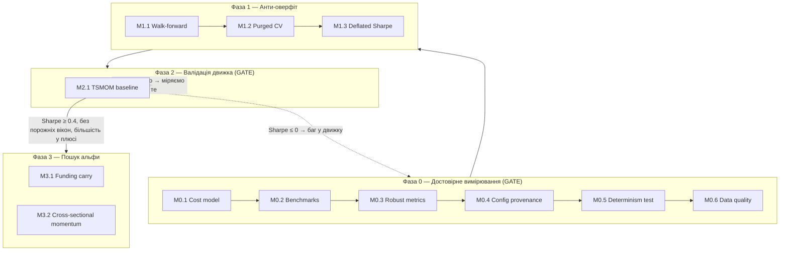

# Роадмап розвитку квант-системи

Технічний спек покращень системи. Кожен мілстоун — самодостатній таск із метою, прив'язкою до гексагональної архітектури та критеріями приймання.

**Стек:** Rust/Tokio · Kafka · ScyllaDB · PostgreSQL · React · ensemble ML · hexagonal architecture · Kafka-replay (єдиний пайплайн бектест + live).

**Головний принцип послідовності:** спершу лагодимо вимірювання (Фаза 0–1), і лише потім полюємо на альфу (Фаза 2–3). Поки бенчмарк, модель витрат і захист від оверфіту не залізні — будь-який «прибутковий» результат обманює.

---

## Інваріанти (не порушувати ніколи)

Залізні правила системи. Прямо лікують болячки, що спливли на захисті (розбіжність параметрів, PnL без бенчмарка).

1. **Єдиний шлях коду.** Бектест і live використовують ту саму логіку сигналів/виконання. Форк логіки під бектест заборонено — тільки різні adapter'и на портах. Це головна перевага системи, вона гарантується тестом (M0.5), а не обіцянкою.
2. **Витрати завжди увімкнені.** Жоден прогін не рахує PnL без транзакційних витрат. «Gross PnL» дозволений лише як окрема діагностична метрика поряд із net, ніколи замість.
3. **Нема look-ahead.** Фіча/сигнал у момент `t` використовує тільки дані з часом `≤ t`. Має бути неможливо порушити на рівні типів/API, а не за домовленістю.
4. **Детермінізм.** Той самий вхід + той самий config hash → побайтово той самий результат. Стосується і ML-ансамблю (фіксовані сіди).
5. **Provenance.** Кожен прогін логується з хешем повного конфіга. Немає «магічних» параметрів у коді — усе з конфіга.
6. **Decimal для грошей.** PnL, ціни, розміри позицій — `Decimal`, ніколи `f64`.

---

## Фаза 0 — Достовірне вимірювання (GATE)

Мета: зробити так, щоб результатам бектесту можна було вірити. **Доки Фаза 0 не закрита — до альфи не переходимо.**

### M0.1 — Модель витрат як first-class domain concept

**Навіщо:** саме витрати вбили PnL (−0,09%). Вони мають бути параметризованим ядром, а не афтерсотом. Almgren-Chriss із розділу 3 — застосувати реально, а не як теорію.

**Реалізація (hexagonal):**
- Domain: трейт `CostModel` з методом на кшталт `fn cost(&self, fill: &Fill, ctx: &MarketContext) -> Decimal`.
- Імплементації: `SimpleCommissionSpread` (комісія + фіксований спред), `AlmgrenChrissImpact` (market impact від розміру/ліквідності), `CompositeCost` (сума кількох).
- Витрати застосовуються в domain-логіці виконання ордера, спільній для бектесту і live.

**Критерії приймання:**
- [ ] PnL у звіті завжди net-of-cost; gross доступний окремо.
- [ ] Тест: збільшення розміру ордера монотонно збільшує impact-складову.
- [ ] Тест: нульова конфігурація витрат → net == gross (регресійний sanity).
- [ ] Параметри витрат читаються з конфіга, не хардкод.

---

### M0.2 — Бенчмарки в ядрі звітності

**Навіщо:** без baseline −0,09% висить у повітрі (пряме зауваження з захисту). Будь-яка стратегія оцінюється тільки відносно «нічого не робити».

**Реалізація:**
- Domain: трейт `Strategy`, а бенчмарки — його тривіальні імплементації: `BuyAndHold`, `EqualWeight`, `SixtyForty`.
- Проходять той самий пайплайн виконання й ту саму модель витрат, що й основна стратегія (щоб порівняння було чесним).
- Репорт завжди друкує рядок стратегії + рядки бенчмарків поруч.

**Критерії приймання:**
- [ ] Кожен звіт містить BuyAndHold, EqualWeight, 60/40 за той самий період і символи.
- [ ] Бенчмарки рахуються тим самим движком (не окремим скриптом).
- [ ] Тест: BuyAndHold на одному активі без ребалансу ≈ проста зміна ціни мінус one-off витрати.

---

### M0.3 — Модуль робастних метрик

**Навіщо:** середній Sharpe 0,59 вводив в оману через MSFT з 3 угодами. Потрібні метрики, стійкі до викидів і чесні щодо ризику.

**Реалізація:**
- Domain: чистий модуль `metrics` (без I/O). Функції: `median_sharpe` (не mean по інструментах), `max_drawdown`, `calmar`, `turnover`, `hit_rate`, `pnl_after_costs`, `profit_factor`.
- Зведений рядок веде з **медіани**, а не середнього. Інструменти з < N угод (напр. N=10) позначаються прапорцем «low-sample», щоб не тягнули агрегат.

**Критерії приймання:**
- [ ] Median Sharpe у зведенні; per-instrument із прапорцем low-sample.
- [ ] Max drawdown, Calmar, turnover присутні в кожному звіті.
- [ ] Тест: один інструмент-викид не зсуває медіанний Sharpe (на відміну від середнього).
- [ ] Тест: MDD на монотонно спадній кривій == повне падіння.

---

### M0.4 — Config provenance (хеш конфіга + логування прогону)

**Навіщо:** пряме лікування головної болячки диплома — 0.6 проти 0.01, SL/TP −3%/+2% проти 1%/2.5%, розмір позиції 65% проти 80% у різних розділах. Більше ніколи не буде питання «а з якими параметрами це рахувалось».

**Реалізація:**
- Єдина типізована структура конфіга — **єдине джерело правди** для всіх параметрів (min_confidence, SL/TP, position size, склад ансамблю). Ніде в коді дублікатів дефолтів.
- На старті прогону: серіалізація конфіга → SHA-256 → записується разом із результатами (у PostgreSQL: таблиця `runs(run_id, config_hash, config_json, metrics, created_at)`).
- CLI-прапор для друку hash + diff двох конфігів.

**Критерії приймання:**
- [ ] Усі торгові параметри — з одного config-типу; grep по коду не знаходить хардкод-дублікатів.
- [ ] Кожен прогін пише рядок у `runs` з config_hash і повним конфігом.
- [ ] Тест: однаковий конфіг → однаковий hash; зміна одного поля → інший hash.

---

### M0.5 — Property-тест детермінізму replay

**Навіщо:** гексагональну архітектуру обґрунтовано тестованістю й усуненням simulation gap — час це реально доставити. Це тест головної переваги системи.

**Реалізація:**
- Property-тест (proptest/quickcheck): для згенерованого потоку тіків результат бектесту й результат прогону через live-пайплайн (на тих самих даних, replay з Kafka) — ідентичні побайтово.
- Фіксація сідів ML-ансамблю, щоб інференс був відтворюваним.

**Критерії приймання:**
- [ ] Тест ганяє N згенерованих сценаріїв; backtest_result == replay_result для кожного.
- [ ] Тест падає, якщо навмисно розсинхронити логіку (перевір, що він взагалі ловить розбіжність).
- [ ] ML-ансамбль детермінований за фіксованого сіда.

---

### M0.6 — Якість даних: point-in-time, корекції, survivorship bias

**Навіщо:** тихий вбивця. Виживальницький зсув і некоректні корекції систематично завищують бектест, і цього не видно, поки не торгуєш реально.

**Реалізація:**
- Adapter даних гарантує **point-in-time**: на момент `t` доступні тільки записи, відомі на `t` (жодних ретроспективно доданих корекцій).
- Корекція на спліти/дивіденди — явна, тестована; зберігати і raw, і adjusted.
- Юніверс формується з урахуванням делістингів (включати «мертві» тікери в історичний юніверс), щоб уникнути survivorship bias.

**Критерії приймання:**
- [ ] API даних неможливо попросити «майбутнє» відносно точки бектесту (enforced типами/контрактом).
- [ ] Тест на коректність adjusted-цін навколо відомого спліту.
- [ ] Історичний юніверс містить делістингнуті інструменти за період.

---

## Фаза 1 — Захист від оверфіту

Мета: щоб «знайдена альфа» не була артефактом перебору гіпотез. При переборі багатьох конфігурацій без цього рано чи пізно «знайдеться» шум.

### M1.1 — Walk-forward framework

**Реалізація:** application-сервіс, що ганяє стратегію по ковзних train/test-вікнах; агрегує out-of-sample метрики (саме OOS, не in-sample). Параметри вікон — з конфіга.

**Критерії приймання:**
- [ ] Метрики звітуються по OOS-сегментах, не по всьому періоду разом.
- [ ] Тест: train- і test-вікна не перетинаються за часом.

### M1.2 — Combinatorial Purged CV з ембарго

**Навіщо:** класична CV тече в часових рядах (сусідні семпли корельовані). Purged CV з ембарго (López de Prado) прибирає leakage між train/test.

**Реалізація:** domain-модуль, що генерує purged-групи з ембарго-періодом; враховує тривалість лейбла (щоб не було перекриття інформації).

**Критерії приймання:**
- [ ] Між train і test завжди є ембарго-зазор; перекриття лейблів вирізане (purged).
- [ ] Тест: жоден test-семпл не має інформаційного перекриття з train.

### M1.3 — Deflated Sharpe / корекція на множинне тестування

**Навіщо:** карає за кількість протестованих гіпотез. Прямо відсіює «щасливі» конфігурації.

**Реалізація:** метрика поверх M0.3, що приймає кількість незалежних випробувань і дисперсію Sharpe по них → deflated Sharpe.

**Обидва входи беруться по перебраних гіпотезах ТІЄЇ Ж стратегії** (`RunLogger::trial_sharpes`), дедуплікованих за config_hash, плюс поточний прогін — він теж гіпотеза. Дві помилки, яких треба уникати (обидві були допущені):
- σ(SR) **не можна** брати як розкид по walk-forward фолдах одного прогону. Це інша величина, оцінена по 3–4 точках, і вона задирає очікуваний максимум так, що поріг стає недосяжним.
- N **не можна** брати як кількість усіх конфігів у журналі. Тоді TSMOM карається за гіпотези carry і funding_ml, які до нього не мають стосунку.

Ефект виправлення на реальному прогоні: DSR 0.17 → 0.61 за незмінних фолдів.

**Критерії приймання:**
- [ ] Deflated Sharpe рахується з урахуванням N trials.
- [ ] Тест: за фіксованого «сирого» Sharpe зростання N trials знижує deflated Sharpe.
- [ ] Тест: за незмінних фолдів ширший розкид по спробах знижує deflated Sharpe (тобто метрика взагалі реагує на історію перебору).

---

## Фаза 2 — Валідація движка відомо-позитивною стратегією (GATE перед альфою)

### M2.1 — TSMOM baseline (time-series momentum)

**Навіщо:** сенс не в прибутку, а в **валідації платформи**. TSMOM (Moskowitz–Ooi–Pedersen) — академічно задокументований стійкий ефект. Якщо пайплайн його **не** відтворює — баг у движку, а не ринок проти тебе. Це найкращий перший тест системи.

**Реалізація:** імплементація трейта `Strategy`: сигнал = знак минулої дохідності за lookback-вікном на диверсифікованому кошику. Проходить увесь стек Фази 0–1.

**Кошик гейта — `datasets/etf`** (SPY, EFA, TLT, IEF, GLD, DBC, USO: акції США / акції поза США / довгі облігації / середні облігації / золото / товари / нафта). Крипта прогоняється поруч **довідково** і на вердикт не впливає.

Чому не крипта, хоча торгуємо саме її: гейт — вимірювальний інструмент для движка, а не проксі торгової стратегії. Вісім монет ходять як одна річ, тож один ведмежий рік б'є по всіх відрізках одразу. Виміряно: розкид між відрізками 0.82 у крипти проти 0.39 у ETF, OOS-вікно 651 день проти 1532, а медіана по крипті стрибнула 0.642 → 1.037 від семи додаткових днів даних. Гиря, вага якої змінюється при повторному зважуванні, — не гиря. Вищий Sharpe крипти — наслідок шуму, а не кращої роботи движка.

Дані тягне `scripts/fetch_reference_data.py` (Yahoo chart API) у форматі `timestamp,adj_close,close,volume`. Adjusted стоїть першим навмисно: для TLT за 20 років дивідендів raw close занижує ціну більш ніж удвічі. `--verify` перевіряє вже закомічені набори і стоїть у CI — попередній набір ETF сім місяців пролежав як HTML-сторінка анти-бот перевірки замість цін, і ніщо цього не ловило.

**Обов'язково лонг І шорт** (`--allow-short`, тобто `long_only: false`). Це не опція, а частина визначення: у MOP стратегія лонгує зростаючі й шортить падаючі, і еталонний Sharpe 0.4–0.8 виміряний саме на повній версії. Порівнювати з ним довгу-тільки половину — міряти одне, а звірятися з іншим.

Довга-тільки версія до того ж **сліпа на ведмежому ринку**: у відрізку 2026-02…07 усі 8 монет кошика стояли нижче за торішню ціну, стратегія коректно сиділа в грошах і дала нуль угод — гейт міряв порожнечу. З шортами той самий відрізок дає 15 угод і +3.7%, а медіана падає з 1.081 (вище еталона) до 0.642 (точно посередині).

**Критерії приймання (GATE):** гейт питає три **структурні** речі, які на наявному обсязі даних перевірити можна.

- [ ] Медіанний OOS-Sharpe ≥ 0.4 після витрат — **у версії лонг+шорт**, бо саме на ній виміряний еталон ~0.4–0.8.
- [ ] **Жоден OOS-відрізок не порожній.** Нуль угод на цілому відрізку означає, що стратегію перевіряють у режимі, де вона сліпа (див. long_only вище) — медіана по решті описує не весь період, і довіряти їй не можна незалежно від значення.
- [ ] **Строга більшість оцінених відрізків у плюсі.** Інакше медіану витягнули один-два вдалі періоди.
- [ ] Медіана рахується **лише по фолдах, де були угоди**. Фолд без жодної угоди — не Sharpe 0, а відсутність спостереження.

**Deflated Sharpe гейтом НЕ є** — друкується поруч як довідка. Причина суто арифметична: поріг 0.95 недосяжний для явища силою Sharpe 0.4–0.8 на наявних ~650 OOS-днях. Навіть за ідеальної стабільності між відрізками Sharpe 0.8 вимагає ≈1066 днів (4.2 роки), Sharpe 0.6 — ≈1900 днів; за реального розкиду — неможливо за будь-якого обсягу. Гейт, який вимагає втричі більше, ніж дає явище, що ним вимірюють, не відсіює шум — він просто ніколи не світиться.

**Kill-критерій** (кожна гілка закриває Фазу 3, діагноз різний):
- Порожній відрізок → **міряємо не те**. Спершу зрозумій, чому стратегія мовчала, і лише потім дивись на числа.
- Sharpe ≤ 0 → **баг у движку**, стоп і шукай його.
- Sharpe додатний, але < 0.4 → движок бачить тренд слабше за еталон, перевір період/кошик.
- Більшість відрізків у мінусі → стійкості немає.

Enforced машинно, не домовленістю: `quant-backtest --strategy tsmom --walk-forward` виходить із ненульовим кодом, якщо гейт не пройдено (прогін при цьому все одно логується — провенанс не залежить від результату). У `research.yml` вердикт піднімається окремим кроком **після** коміту, щоб провалений гейт не вбивав збір даних. На фікстурі гейт стереже CI-тест `smoke_tsmom_gate_holds_on_fixture`.

---

## Фаза 3 — Пошук альфи (тільки після проходження Gate Фази 2)

Принцип: менш ефективний ринок + безкоштовні дані + дешева фальсифікація. Для кожного напряму — kill-критерій, щоб відсіяти за вечір-два, а не за місяці.

### M3.1 — Crypto funding-rate / basis carry (перший реальний кандидат)

**Навіщо:** funding між перпами і спотом — майже механічний, документований едж, що краще за directional переживає витрати. Дані безкоштовні й рясні (Binance/Bybit API). Найкращий кандидат на реальну альфу для соло-розробника.

**Реалізація:**
- Adapter даних funding-rate + spot/perp цін (нові порти, та сама архітектура).
- Стратегія carry: позиція від знаку/величини funding з урахуванням basis; ребаланс на funding-інтервалах.
- Обов'язково через повну модель витрат (carry чутливий до fee/slippage).

**Свіжість даних.** `fundingRate` публікується **тільки місячними архівами** — денної категорії в `data/futures/um/daily/` не існує взагалі. Тому архівний шлях завжди відстає на 1–31 день. Хвіст поточного місяця добирає REST (`fapi/v1/fundingRate`), але з US-раннерів GitHub він заблокований, тож у CI цей крок мовчки пропускається: **свіжість тримається локальними прогонами** `python3 scripts/topup_data.py`.

Саме цей невидимий лаг зробив рядки RESEARCH_LOG за 07-13…07-27 копіями одного прогону: вхід не змінювався, а таблиця виглядала як щотижневе підтвердження. Тому:
- [ ] Колонка «дані funding до» в кожному рядку журналу — з віком у днях, за **найвідсталішим** символом (не за найсвіжішим: набір свіжий рівно настільки, наскільки свіжий найгірший інструмент).
- [ ] `topup_data.py --check-freshness` валить прогін, якщо вік > 40 днів (поріг ловить поломку, а не звичайний місячний лаг), або якщо є недодатні марк-ціни / незібраний порядок.
- [ ] Дубльовані таймстемпи — **попередження, не помилка**: біржа справді віддає дві події в одну мить (NVDAUSDT 2026-06-04T00:00, зміна інтервалу фандингу). Видаляти їх — підробка запису.

**Торгованість юніверсу (виявлено 2026-08-03).** Carry за визначенням тримає лонг спота проти шорта перпа. Немає спот-ринку — немає другої ноги, і угоди не існує: не дорожчої, не ризикованішої, а взагалі. Юніверс `datasets/funding` цього не розрізняв, і наслідок виявився не крайовим випадком, а системним: **спот-пару на Binance мають 19 із 45 перпів**, а в кошику тіньового журналу за 2026-08-02 їх було **0 із 10 в обох кошиках** (baseline_est і rf).

Причина економічна. Топ за фандингом — KORUUSDT (193% річних), SKHYNIXUSDT (161%), SOXLUSDT (104%), MUUSDT, EWYUSDT, SNDKUSDT, NVDAUSDT, MSTRUSDT, XAUUSDT: токенізовані акції, ETF і товари. Фандинг там величезний **саме тому, що його нікому арбітражити** — спот-ноги немає, канал закритий, ставка нікуди не збігається. Ранжування за величиною фандингу систематично відбирає рівно ці контракти. Високий фандинг тут не сигнал можливості, а підпис неарбітражованого перпа.

Фільтр (`universe.require_spot_leg`, дефолт `true`) читає закомічений маніфест `datasets/spot_pairs.csv` — юніверс мусить бути частиною входу прогону, а не залежати від відповіді біржі в мить запуску (інваріанти 4 і 5). Будує маніфест `scripts/fetch_spot_pairs.py`: основне джерело `exchangeInfo`, запасне — проба спот-архіву; обидва звірені на всьому юніверсі й дали той самий набір із 19. `--verify` стоїть у CI. `--no-spot-filter` лишає старий юніверс для порівняння і входить у `config_hash`, тож у журналі прогонів такі гіпотези не змішуються.

Що фільтр зробив із числами (той самий прогін, 43 → 19 перпів):

| | без фільтра | з фільтром |
|---|---|---|
| xs_carry OOS, taker 0.045% | net 9570, Sharpe 7.76 | net 493, **Sharpe 0.383** |
| xs_carry OOS, maker 0.018% | net 10091, Sharpe 8.70 | net 1402, Sharpe 1.373 |
| carry-кошик базлайн | 14.00 %/рік | 1.64 |
| RF-ранжування | 14.34 | 1.81 |
| **стеля (ідеальний прогноз)** | 19.49 | **3.80** |

Ключовий рядок — стеля: це те, що дало б безпомилкове передбачення майбутнього фандингу на хеджованому юніверсі, до витрат. Уся різниця між 14% і 1.6% була в перпах, які неможливо торгувати. На тейкері витрати з'їдають 74% валового фандингу (1401 із 1894) проти 8% раніше.

**Критерії приймання:**
- [ ] Backtest на реальних funding-даних, OOS через walk-forward.
- [ ] Витрати й фандинг враховані в PnL коректно (не подвійний облік).
- [ ] Юніверс ранжування містить **лише перпи зі спот-ногою** — інакше стратегія відбирає угоди, яких не існує.

**Kill-критерій:** після реалістичних витрат і фандингу OOS-Sharpe < 0.5 → відкладай напрям.

**Статус kill-критерію на 2026-08-03:** на тейкері **0.383 — критерій спрацював**; на мейкері 1.373 — ні. Який сценарій вважати реалістичним, не вирішено: `docs/xs-carry-sharpe-audit.md` прямо каже, що maker-філ на ребалансі не гарантований (adverse selection), а в стресі виконання тейкерне. Рішення за напрямом лишається відкритим і ухвалюється явно, а не мовчазним вибором зручнішого рядка.

**Що це робить із жовтневим рішенням.** Три final-тижні тіньового журналу (`shadow/results.jsonl`, 07-11…07-19) міряли кошики, у яких торгованих символів було 0 з 10 — вони не є спостереженнями за стратегією, яку оцінюємо, і в залік не йдуть. Лічильник «≥6 final-тижнів» стартує заново: перший запис на новому юніверсі — 2026-08-10, шостий стане `final` близько 2026-10-05 (виміряний лаг якір→final — 23 дні, не «~місяць»). Дата рев'ю переноситься 2026-10-05 → **2026-10-19**, із запасом на пізню публікацію архіву.

Критерії переписані на **v2** (`shadow/DECISION_CRITERIA.md`, 2026-08-03). v1 збережена там же дослівно — критерії суперсідяться з датою й причиною, а не видаляються. Підстава заміни структурна, не результатна: поріг +8%/рік калібрувався проти очікування ~14%, а на хеджованому юніверсі стеля за ідеального прогнозу — 3.80%, тобто поріг удвічі вищий за саме явище і не може спрацювати ніколи (та сама помилка, що з DSR 0.95 в M2.1).

Заразом виправлено справжній дефект v1: поріг був абсолютний і **ні з чим не порівнювався**, усупереч інваріанту M0.2. v2 міряє **net** carry проти дохідності тих самих грошей, що просто лежать (USDT flexible earn, не нижче 4%/рік, плюс 3 п.п. за операційний ризик) — тобто ≥7%/рік. Це вимогливіше за v1, а не м'якше.

**Чесне розкриття, записане і там, і тут:** v1 писалася до появи даних, v2 пишеться, коли net уже виміряний — 1.14%/рік (maker) і 0.40% (taker). Захист від підгонки не в даті, а в тому, що поріг v2 не виводиться зі спостережених чисел узагалі, і що наслідок відомий наперед: **за поточних чисел критерій не проходить**, напрям іде у «відкласти, не вбивати».

**Чого фільтр НЕ лікує.** У 100% рядків funding-датасетів `spot_price == mark_price` (свідома угода, задокументована в `src/trading/adapters/htx/funding_history.rs`), тож базисний ризик усе ще вирізаний з даних конструкцією, а `price_pnl` тотожно нульовий. Це рівень 2 тієї самої роботи: реальні спот-ціни (архів `data/spot/monthly/klines/`, доступний для тих же 19) або оцінка з `premium`, яка вже лежить у `datasets/perp_meta/*.csv` 8-годинною колонкою з 2022-01-01. `datasets/funding_htx` має ту саму угоду і свій юніверс — маніфест Binance до нього не застосовний.

### M3.2 — Cross-sectional momentum (не absolute)

**Навіщо:** поточна логіка — absolute momentum з порогом на одному інструменті (слабка форма). Крос-секційний рейтинг (лонг топ-децилю / шорт нижнього на широкому юніверсі) історично робастніший і market-neutral за конструкцією.

**Реалізація:**
- Стратегія: ранжування юніверсу за momentum-скором → лонг верх / шорт низ, dollar-neutral.
- Контроль turnover (тут він високий — головний ризик з'їдання едж витратами).

**Критерії приймання:**
- [ ] Market-neutral за конструкцією (сума ваг ≈ 0).
- [ ] Turnover і його вартість явно у звіті.

**Kill-критерій:** edge зникає після turnover-costs → знижуй частоту ребалансу або кидай напрям.

**Чого НЕ чіпати першим:** directional-прогноз ціни окремого активу (найперенаселеніша ніша, ти там проти HFT), опціонні/vol-стратегії (важкі дані, складна інфра), alt-data (дорого діставати, повільно валідувати). Це не «ніколи», це «не зараз».

---

## Наскрізні задачі (паралельно)

### Документація репо
Файл документації з оглядом гексагональної архітектури, мапою domain/ports/adapters, конвенціями і **дослівно інваріантами з розділу вище**. Оновлювати при додаванні нових портів.

### CI-пайплайн
На кожен PR: `cargo test` + `cargo clippy` + smoke-бектест на маленькому фікстур-датасеті. Регресія детермінізму (M0.5) або витрат (M0.1) валить білд.

### Unit-тести на domain-логіку
Розділ 4 диплома нічого не казав про юніт-тести, хоча тестованість була аргументом за гексагон. Покрити: cost model, metrics, strategy-логіку, config-хешування, purged CV. Ціль — щоб інваріанти були enforced тестами, а не домовленістю.

### Risk / sizing консолідація
Kelly-сайзинг є (розділ 3), але параметри «пливли» між розділами. Винести position sizing у єдиний domain-компонент, керований одним конфігом (лікує розбіжність 65% vs 80%).

---

## Послідовність і гейти

---

## Definition of Done по фазах

**Фаза 0 закрита, коли:** будь-який бектест друкує net-of-cost PnL + бенчмарки + робастні метрики, кожен прогін залогований з config-хешем, детермінізм replay доведений тестом, дані point-in-time без survivorship bias. → Результатам можна вірити.

**Фаза 1 закрита, коли:** усі оцінки — OOS через walk-forward + purged CV, а Sharpe дефлейтований на число trials. → «Знахідка» ≠ шум від перебору.

**Фаза 2 — Gate:** TSMOM відтворює документований додатний Sharpe **на всьому періоді** — без вікон, де стратегія сліпа, і зі стійкою більшістю відрізків у плюсі. → Движок валідний, можна шукати справжню альфу. Deflated Sharpe при цьому звітується, але не блокує (див. M2.1, чому).

**Фаза 3:** кожен напрям проходить свій kill-критерій на OOS-даних, або чесно відкидається. → Або реальний edge, або як мінімум дуже сильний інженерний профіль.